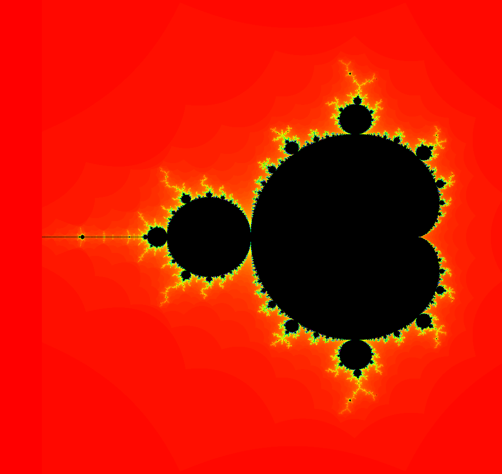

# Chapter 4 Lab Manual

Some exercises are adapted from similar lab assignments found at https://github.com/orhs-apcs/chapter-4 

## Getting Started

See instructions from [Chapter 1](https://github.com/nuhs-apcs/chapter-1).

## Running Unit Tests

In this chapter, exercises 1-5 have unit tests that will automatically test your code for you. To run the tests, right click on the `src/test` folder and select `JUnit Test` under `Run As`. Once you do so, a window should open showing all of the tests and their results.

## Labs

1. Coin Flips
2. Bank Account
3. Grades
4. Names
5. Rectangles
6. Hangman
7. Fractals

## Coin Flips

In the lab project, there is a `Coin` class that implements the basic behavior of a coin. Your task is to write a program in the `CoinDriver` class that finds the length of the longest run of consecutive heads in 100 flips of a coin. You will need to use a `Coin` object to emulate the coin flips. A skeleton of the program is provided in the `CoinDriver.java` file that explains the details of your program implementation. 

Here is a sample run of the program:

```
Tails
Heads
Heads
Heads
Heads
Heads
Heads
Tails
Tails
Tails
Heads
Heads
Tails
Heads
Heads
--- output truncated to save space --- 
The maximum run of HEADS was 6
```

## Bank Account

The file `Account.java` contains a partial definition for a class representing a bank account. Complete the `Account` class as described below.

1. Create instance variables for the parameters listed in the constructor and assign them correspondingly inside.
2. Complete the `withdraw()` method so that it subtracts the withdrawal amount from the balance if there are sufficient funds and prints a warning message otherwise. For extra practice, you may also write appropriate preconditions above the method.
3. Complete the `deposit()` method so that is adds the deposit amount to the balance if the amount is positive and prints a warning message otherwise. For extra practice, you may also write appropriate preconditions above the method.
4. Complete the `toString()` method body; this should return a string containing the name, account number, and the balance for the account. **Note:** the `toString()	` should not call `System.out.println()` and instead just return the appropriate string representation.
5. Fill in the code for `chargeFee()` so that it deducts a service fee from the account.
6. Fill in the code for `changeName()` so that it takes a string as a parameter and set the account name to the provided string.

## Grades

A teacher wants a program to keep track of grades for students and decides to create a `Student` class for use in the program:

1. Each student will be described by three pieces of data: his/her name, his/her score on test #1, and his/her score on test #2.

2. There will be a single constructor that takes the name of the student as its only argument.

3. There will be three methods: `getName()`, which will return the student's name; `inputGrades()`, which will prompt for and read in the student's test grades (using a `Scanner`); and `getAverage()`, which will compute and return the student's average.

4. There will be a `toString()` method which prints a summary of the student per the following example (yes, using tabs when necessary):

   ```
   Name: Joe	Test1: 85	Test2: 91
   ```

Complete the class definition in `Student.java` appropriately. 

## Names

Implement a `Name` class with the following methods:

- `public Name(String first, String middle, String last)`—constructor
- `public String getFirst()`—returns the first name
- `public String getMiddle()`—returns the middle name
- `public String getLast()`—returns the last name
- `public String firstMiddleLast()`—returns a string containing the person's full name in order, e.g. `"Mary Jane Smith"`
- `public String lastFirstMiddle()`—returns a string containing the person's full name with the last name first followed by a comma, e.g. `"Smith, Mary Jane"`
- `public boolean equals(Name otherName)`—returns `true` if this name is **case-insensitively** equal to `otherName`
- `public String initials()`—returns the person's initials all uppercase, e.g. `"MJS"`
- `public int length()`—returns the total number of characters in the full name, **not** including spaces

## Rectangles

Implement a `Rectangle` class with the following methods:

- `public Rectangle(double width, double height)`—if the width or height is less than 0, make it positive
- `public double getWidth()`
- `public double getHeight()`
- `public double area()`—returns the area of the rectangle
- `public double perimeter()`—returns the perimeter of the rectangle
- `public String toString()`—returns a string representation of the rectangle containing the width and height, e.g. `"90x102"` (width first, then height)
- `public boolean equals(Rectangle other)`—two rectangles are equal if their dimensions are equal (within a tolerance of 0.00001 for the `double` comparisons)
- `public double diagonal()`—returns the length of the diagonal of the rectangle
- `public boolean isSquare()`—returns `true` if the rectangle is square (again, within a tolerance of 0.00001)

## Hangman

At some point in your life, I'm sure you've played the game Hangman. To refresh your memory, the objective of Hangman is to guess an unknown word by choosing certain letters that you believe may be in the word. In our version of the game, the computer generates a random word while the human user is tasked with guessing the words. Here is the general procedure:

1. The computer chooses a random word and tells the user how many letters the word has.
2. The computer prints out the valid letters (lowercase a-z minus the previously-guessed letters) and prompts the user to guess a letter.
   1. If the word contains the letter, the computer prints out a congratulatory message containing the letters of the word guessed so far with underscores in the positions of the missing letters.
   2. Otherwise, a different message is printed and the number of guesses is decremented by 1.
3. Repeat the previous step until either the word is guessed or the number of guesses is 0.


Example run:

```
Welcome to the game, Hangman!
I'm thinking of a word that is 5 letters long
-------------
You have 8 guesses left
Available letters: abcdefghijklmnopqrstuvwxyz
Please guess a letter: a
Good guess: __a__
-------------
You have 8 guesses left
Available letters: bcdefghijklmnopqrstuvwxyz
Please guess a letter: e
Good guess: __a_e
-------------
You have 8 guesses left
Available letters: bcdfghijklmnopqrstuvwxyz
Please guess a letter: p
Good guess: __ape
-------------
You have 8 guesses left
Available letters: bcdfghijklmnoqrstuvwxyz
Please guess a letter: t
Oops! That letter is not in my word
-------------
You have 7 guesses left
Available letters: bcdfghijklmnoqrsuvwxyz
Please guess a letter: s
Good guess: s_ape
-------------
You have 7 guesses left
Available letters: bcdfghijklmnoqruvwxyz
Please guess a letter: h
You guessed the word: shape
```

All of the code for this exercise is in `Hangman.java`. Your task it two-fold: First, fill in the code in `playHangman()` according to the comments inside. Second, there are a few logical errors (bugs) in the program that need to be debugged. Once you fix them all, the program should run properly. You may find it helpful to walk through the code using Eclipse's debugger for the second portion of this exercise. 

## Optional: Fractals

### Introduction

This exercise explores a strange and curious family of geometric objects: fractals. Benoit Mandelbrot coined this term to describe rough, fragmented geometric shapes that exhibited the curious property of self-similarity. No matter how far you zoom in on a fractal, it's structure remains the same. 

Fractals are easiest understood through examples. The Koch Snowflake is a popular fractal first described in 1904. This fractal is generated by a simple geometric procedure:

1. Begin with an equilateral triangle
2. Split each side of the equilateral triangle into three equal parts
3. Construct an equilateral triangle for each side using the middle part as the base
4. Remove the base of each new equilateral triangle (green in the picture below)
5. Repeat steps 2-5 for each side of our new figure (forever)

A few iterations of this procedure are visualized below:


Now, imagine zooming in on the boundary of the fractal. After a certain level, you would be unable to tell how far you've zoomed in; this is what mathematicians mean by self-similarity. 

### The Mandelbrot Set

Now that we've seen a basic fractal, we're ready to move on to something a little more complicated. This section describes how to approximately generate the Mandelbrot Set. Here is a colorized image of the set (and what we'll be attempting to replicate):


In addition to the geometric constructions (like the one for the Koch Snowflake), fractals can be created in other ways. In particular, the Mandelbrot set is generated using a special sequence of complex numbers. I know, complex numbers probably weren't your favorite part of Algebra II, but bear with me. In the following equations, $z_i$ and $c$ are complex numbers (numbers of the form $a+bi$ where $i^2=-1$). Our sequence is defined using the recurrence $z_n=z_{n-1}^2+c$ where $z_0=0$ . To compute the sequence, all you need to do is take the last $z_i$, square it, and add $c$—simple enough. This sequence describes which complex numbers fit in the Mandelbrot Set; for a given complex number $c$, it is in the set if the numbers of the sequence $z_0, z_1, z_2, ...$ eventually go to zero (we'll call this convergence; the opposite of convergence is divergence). 

### Computing the Mandelbrot Set

In practice, there's no way that we can compute all of the numbers in the sequence ${z_i}$—there's an infinite number of them. However, it turns out that we only have to compute a few. The general algorithm starts with $z_0$ and computes the successive values of the sequence. If at any point along the way the real or imaginary part exceeds 2 or -2, we assume that the sequence diverges. If we are able to compute all $z_i$ values up until a threshold (e.g. $i=200$)  without the sequence diverging, we assume it converges. 

### Your Task

The code to make the pretty pictures work is already done for you; all you have to do is the math part. To open the GUI, run the `FractalFrame.java` program in Eclipse. To exit, you can either click the red 'X' in to close the window or press the red square in Eclipse (ignore any messages in the console). Right now, the window should be completely red. Your job is to make it look like this:



To do this, open up `MandelbrotTest.java` and fill in the `testPoint()` method. The `real` and `imag` arguments represent the real and imaginary parts, respectively, of the $c$ from before (the number to test). The `maxIterations` argument tells you how many iterations to compute before deciding convergence (see the **Computing the Mandelbrot Set** section). The controls for the GUI are pretty straightforward; left-clicking zooms in 2x, right-clicking zooms out 2x, and dragging the mouse selects a region to zoom in on. Additional controls are available in the menu. A helpful one if you mess up the zoom is `View > Reset`. Good luck!


